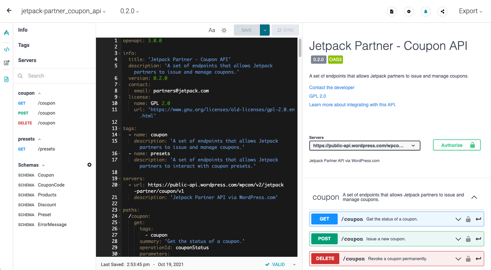
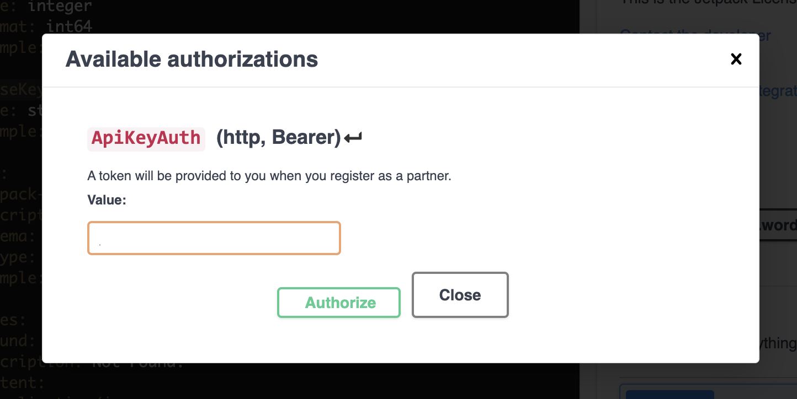
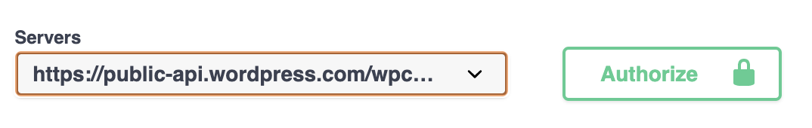

# Jetpack Partner API

This documentation describes the Jetpack Partner API and how to get started using it. The API encompasses multiple sub-APIs for various partner-specific use cases.

## Table of Contents

- [Sub-APIs](#sub-apis)
- [Authentication](#authentication)
- [Schema definition](#schema-definition)

## Sub-APIs

- [Coupon API](./coupon) - Issue and manage Jetpack.com discount coupon codes.

## Authentication

Unless otherwise specified, all endpoints require a Bearer token as authentication which needs to be passed via the `Authorization` header in requests like so:
```
Authorization: Bearer YOUR_ACCESS_TOKEN
```

The required Bearer token will be provided to you by the Jetpack Infinity team.

## Schema definition

APIs come with a `schema.yml` file following the OpenAPI v3 specification that describes all the current endpoints and data structures. It's simple enough to be read by a human, but we chose the OpenAPI format specifically because it's easily consumable by different software packages. By using the schema file in conjunction with an external software package you can augment its functionality and will be able to try the API fully without having to write a single line of code. Probably the best way to get started with the schema file is to render it with SwaggerHub.

### SwaggerHub

To use an API schema file in SwaggerHub:

1. Create a free account at https://app.swaggerhub.com/signup?channel=direct.
2. Create a new blank API.
3. Paste the contents of `spec.yml` as your Swagger spec and save.
4. Click "Show UI Docs" on the left vertical bar and you should see something similar to the screenshot below.



As part of the process of becoming a Jetpack Partner you will we given an authentication token which you will use to authenticate API calls. SwaggerHub allows you to enter the token into its UI and it will authenticate API calls for you. Click on the `Authorize` button on the right panel and you will be prompted to input the token.



> Important! You will be given a test token and a production token. Make sure you first try the API with your test token so that you don't get billed for the licenses you issue while testing.

Depending on if you set the "Auto Mock API" on or off when you created the API, you might see one or two servers available for you to use. Make sure you select the one that has `public-api.wordpress.com` in the domain as the other one is SwaggerHub's own mock server.




That's it! You can now execute any endpoints from the SwaggerHub documentation without having written a single line of code.

### Postman

For those teams that are already using Postman, you'll be happy to know that the schema file can be imported into Postman as well. Once you do that, a new collection will appear in your list. Remember that you will need to configure the token into Postman so that it knows how to authenticate API calls. The easiest way to do this is to paste the token in the `Authorization` tab for each request that requires authentication. For the long term you'll want to set up an environment variable with your token and reference that variable in each request instead of hardcoding the token for each endpoint. However, that's beyond the scope of this document.
